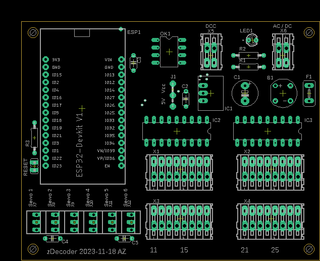

# DCC zDecoder
- [DCC zDecoder](#dcc-zdecoder)
	- [Beschreibung](#beschreibung)
	- [Librarys](#librarys)
	- [Pin mapping](#pin-mapping)
	- [Betriebsarten](#betriebsarten)
		- [in Vorbereitung](#in-vorbereitung)
	- [Schema](#schema)
	- [Anschlüsse](#anschlüsse)
	- [WiFi](#wifi)
		- [Default Password](#default-password)
		- [Default IP address](#default-ip-address)
		- [OTA](#ota)
		- [Configuration options](#configuration-options)
		- [Blinking codes](#blinking-codes)
	- [Reset](#reset)

## Beschreibung
Das ist ein NRMA DCC dekoder basirend auf einem ESP32 NodeMCU. 
- Er kann bis zu 16 Ausgänge ansteuern. 
- Stellt eine Wifi AP zur verfügung oder kann in Wifi Netz integriert werden
- Wird via Web UI konfiguriert
- Kann via DCC oder Web UI gesteuert werden

Der Decoder kann an einer Spannung von 8 - 28V DC oder 18 - 36V AC betrieben werden. Pro Ausgang 
kann eine Last von 500mA geschaltet werden. Ist J1 auf der Stellung 5V, darf der gesamt Strom 1A
nicht übersteigen.

[Top of document](#dcc-zdecoder)

## Librarys
Die folgenden Bibliotheken werden verwendet und müssen installiert werden
- prampec/IotWebConf
- NmraDcc

[Top of document](#dcc-zdecoder)

## Pin mapping
In der Header datei [pinmapping.h](src/pinmapping.h) können die Pins für die 16 Ausgänge an die eigenen Bedürfnisse angepasst werden.

```cpp
static uint8_t ChannelToGPIOMapping[16] = {
	GPIO_NUM_16,
	GPIO_NUM_17,
	GPIO_NUM_18,
	GPIO_NUM_19,
	GPIO_NUM_21,
	GPIO_NUM_22,
	GPIO_NUM_23,
	GPIO_NUM_26,

	GPIO_NUM_12,
	GPIO_NUM_13,
	GPIO_NUM_14,
	GPIO_NUM_4,
	GPIO_NUM_25,
	GPIO_NUM_27,
	GPIO_NUM_32,
	GPIO_NUM_33

};
```
[Top of document](#dcc-zdecoder)

## Betriebsarten

Der zDecoder untersützt folgende Betriebsarten
- [Watchdog](doc/watchdog.md#watchdog-1)
- [einfacher Ausgang](doc/blinkers.md#einfacher-ausgang)
- [Blinker](doc/blinkers.md#blinker)
- [Wechselblinker](doc/blinkers.md#wechselblinker)
- [Fernseher](doc/blinkers.md#fernseher)
- [Schweisslicht](doc/blinkers.md#schweissen)
- [Feuer](doc/blinkers.md#feuer)
- [Blitzlicht](doc/blinkers.md#blitzlicht)
- [Lauflicht 1](doc/blinkers.md#lauflicht-1)
- [Lauflicht 2](doc/blinkers.md#lauflicht-2)
- [Lauflicht 3](doc/blinkers.md#lauflicht-3)
- [Lauflicht 4](doc/blinkers.md#lauflicht-4)
- [Hausbeleuchtung](doc/blinkers.md#hausbeleuchtung)
- [Neonlampen](doc/blinkers.md#neon-lampe)
- [Natriumlampen](doc/blinkers.md#natrium-lampe)
- [Entkuppler](doc/coils.md#entkuppler)
- [Weiche](doc/coils.md#weiche)
- [Servo](doc/servo.md#servo-1)

[Top of document](#dcc-zdecoder)

### in Vorbereitung
- SBB Hauptsignal 2 flammig
- SBB Hauptsignal 3 flammig
- SBB Hauptsignal 4 flammig
- SBB Hauptsignal 5 flammig
- SBB Zwergsignal
- Strassensignal

[Top of document](#dcc-zdecoder)

## Schema



[Partliste](sch/partlist.txt)

[Top of document](#dcc-zdecoder)

## Anschlüsse

| Klemmenblock | Beschreibung |
| --- | --- |
| X1 - X2 | + Anschluss für Verbraucher 5/12-28VDc, je nach position von J1 |
| X3 - X4 | - Anschluss für Verbraucher |
| X5 | DCC signal |
| X6 | Anschluss versorgungspannung für Decoder und Verbraucher. 12 - 28VDC/AC |
| X7 - X12 | Anschluss für Servos |

[Top of document](#dcc-zdecoder)

## WiFi

### Default Password

Wenn nicht mit einem AP verbunden, ist das Standardpasswort 123456789

[Top of document](#dcc-zdecoder)

### Default IP address

Wenn nicht mit einem AP verbunden, ist die IP Adresse 192.168.4.1

[Top of document](#dcc-zdecoder)

### OTA 
OTA ist aktiviert und kann verwenbdet werden. Die IP Adresse ist entweder die Default IP address oder die vom AP zugewissene. Port ist Standart

[Top of document](#dcc-zdecoder)

### Configuration options
Nach dem ersten Start müssen einige Werte eingerichtet werden.

| Parameter | Beschreibung |
|---|---|
| Thing name | Name des Decoders. Es sollten keine Sonderzeichen und <br> Umlaute verwendet werden. Punkte und Leerzeichen sollten <br> ebenfalls nicht verwendet werden.
| AP password | Dieses Passwort wird verwendet, wenn Sie später auf <br> das Gerät zugreifen möchten. Sie müssen ein Passwort <br> mit mindestens 8, höchstens 32 Zeichen verwenden. <br> Es steht Ihnen frei, beliebige Zeichen zu verwenden, <br> Es sollte ein Passwort mit mindestens 12 Zeichen Länge gewählt werden. |
| WiFi SSID | Name des WLan mit welchem das thing verwendet werden soll. |
| WiFi password | Das Passwort zum Netzwerk, mit welchem das Thing verbunden werden soll. |

[Top of document](#dcc-zdecoder)

### Blinking codes

In der nachfolgenden Tabelle fasst die verschiedenen Blinkcodes zusammen

| Code | Bedeutung |
|---|---|
| rasches blinken | meisten ein, unterbrochen durch kurze aus perioden. <br> Eigener AP ist aktiviert und sie können mit <br> dem Smartphone oder einem Computer eine<br> Verbindung zum Thing herstellen. |
| wechsel blinken | Das Thing versucht mit einem AP zu verbinden |
| langsames blinken | meistens aus mit kurzem blinken <br> Das Thing ist online und mit dem WLan verbunden |

[Top of document](#dcc-zdecoder)

## Reset
Wurde das Passwort vergessen oder funktioniert der Decoder nicht mehr kann durch schliessen des Jumpers Reset während dem booten, der Decoder auf die Werkseinstellungen zurückgesetzt werden.

[Top of document](#dcc-zdecoder)

