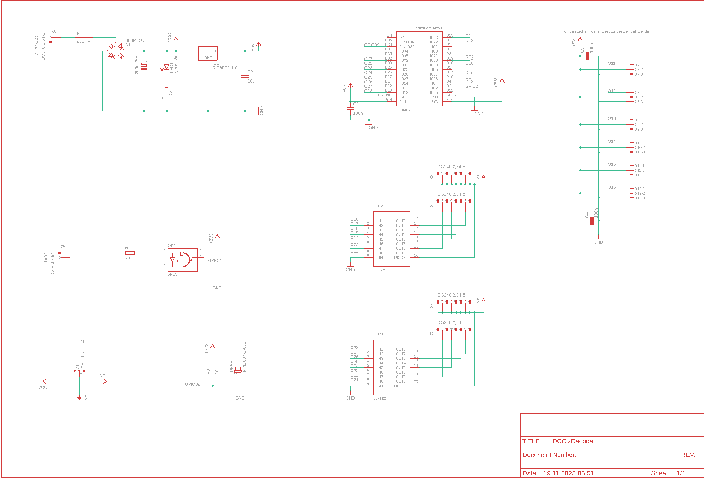

# DCC zDecoder

Das ist ein NRMA DCC dekoder basirend auf einem ESP32 NodeMCU. 
- Er kann bis zu 16 Ausgänge ansteuern. 
- Stellt eine Wifi AP zur verfügung oder kann in Wifi Netz integriert werden
- Wird via Web UI konfiguriert
- Kann via DCC oder Web UI gesteuert werden

## Inhalt
- [DCC zDecoder](#dcc-zdecoder)
  - [Inhalt](#inhalt)
  - [Betriebsarten](#betriebsarten)
    - [in Vorbereitung](#in-vorbereitung)
  - [Schema](#schema)
  - [WiFi](#wifi)
    - [Default Password](#default-password)
    - [Default IP address](#default-ip-address)
    - [OTA](#ota)
    - [Configuration options](#configuration-options)
    - [Blinking codes](#blinking-codes)
    - [Reset](#reset)

## Betriebsarten

Der zDecoder untersützt folgende Betriebsarten
- [Watchdog](doc/watchdog.md)
- [einfacher Ausgang](doc/blinkers.md)
- [Blinker](doc/blinkers.md)
- [Wechselblinker](doc/blinkers.md)
- [Fernseher](doc/blinkers.md)
- [Schweisslicht](doc/blinkers.md)
- [Feuer](doc/blinkers.md)
- [Blitzlicht](doc/blinkers.md)
- [Lauflicht 1](doc/blinkers.md)
- [Lauflicht 2](doc/blinkers.md)
- [Lauflicht 3](doc/blinkers.md)
- [Lauflicht 4](doc/blinkers.md)
- [Lausbeleuchtung](doc/blinkers.md)
- [Neonlampen](doc/blinkers.md)
- [Natriumlampen](doc/blinkers.md)
- Entkuppler
- Weiche
- [Servo](doc/servo.md)

### in Vorbereitung
- SBB Hauptsignal 2 flammig
- SBB Hauptsignal 3 flammig
- SBB Hauptsignal 4 flammig
- SBB Hauptsignal 5 flammig
- SBB Zwergsignal
- Strassensignal

## Schema

[Partliste](sch/partlist.txt)

## WiFi

### Default Password

Wenn nicht mit einem AP verbunden, ist das Standardpasswort 123456789

### Default IP address

Wenn nicht mit einem AP verbunden, ist die IP Adresse 192.168.4.1

### OTA 
OTA ist aktiviert und kann verwenbdet werden. Die IP Adresse ist entweder die Default IP address oder die vom AP zugewissene. Port ist Standart

### Configuration options
Nach dem ersten Start müssen einige Werte eingerichtet werden.

| Parameter | Beschreibung |
|---|---|
| Thing name | Name des Decoders. Es sollten keine Sonderzeichen und   Umlaute verwendet werden. Punkte und Leerzeichen sollten   ebenfalls nicht verwendet werden.
| AP password | Dieses Passwort wird verwendet, wenn Sie später auf   das Gerät zugreifen möchten. Sie müssen ein Passwort   mit mindestens 8, höchstens 32 Zeichen verwenden.   Es steht Ihnen frei, beliebige Zeichen zu verwenden,   Es sollte ein Passwort mit mindestens 12 Zeichen Länge gewählt werden. |
| WiFi SSID | Name des WLan mit welchem das thing verwendet werden soll. |
| WiFi password | Das Passwort zum Netzwerk, mit welchem das Thing verbunden werden soll. |

### Blinking codes

In der nachfolgenden Tabelle fasst die verschiedenen Blinkcodes zusammen

| Code | Bedeutung |
|---|---|
| rasches blinken | meisten ein, unterbrochen durch kurze aus perioden.   Eigener AP ist aktiviert und sie können mit   dem Smartphone oder einem Computer eine  Verbindung zum Thing herstellen. |
| wechsel blinken | Das Thing versucht mit einem AP zu verbinden |
| langsames blinken | meistens aus mit kurzem blinken   Das Thing ist online und mit dem WLan verbunden |

### Reset
Wurde das Passwort vergessen oder funktioniert der Decoder nicht mehr kann durch schliessen des Jumpers Reset während dem booten, der Decoder auf die Werkseinstellungen zurückgesetzt werden.

